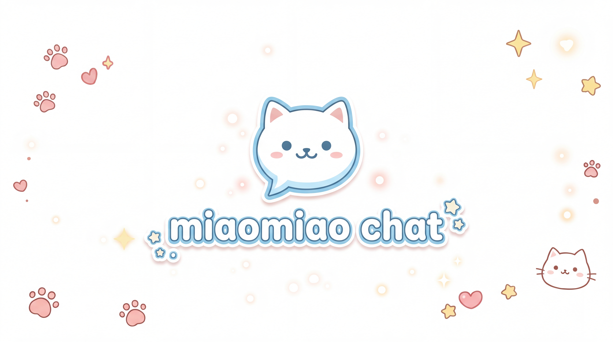

<div align="center">



# Miaomiao Chat

A cross-platform AI chat client with fine-grained control over every request.

[][release-link]
[][license-link]
[](#download)
[][repo-link]

English | [简体中文](#简体中文)

</div>

## Overview

Miaomiao Chat runs on Windows, macOS, Linux, Android, and the browser from a single codebase. There is no backend: it is pure frontend ES6 modules talking directly to your API provider.

It targets users who want more than a text box and a temperature slider. Five API formats, a three-layer message prefill system, MCP tool support, Computer Use, and per-request tuning down to custom HTTP headers.

## Features

### API and parameters

- Five API formats in one client: OpenAI Chat Completions, OpenAI Responses, Gemini, Claude, and OpenClaw
- Cross-format parameter sync: adjust a value in one format and it carries over to the others
- Thinking chain across all formats, including Claude adaptive thinking with effort levels and Gemini thinking budget
- Output verbosity control and a thinking None mode for the Responses API
- Custom HTTP headers for proxy auth or custom routing
- XML tool-calling fallback that injects tool descriptions into the system prompt when a backend lacks native tool support
- Named config profiles you can save, switch, and delete

### Prefill system

Three independent layers of message injection, each with its own presets.

```
[System Prompt]              Layer 1: system instructions
[Opening Message #1]         Layer 2: simulated conversation history
[Opening Message #2]                  inserted before real messages
...
[Real conversation history]
...
[User's latest input]
[Prefill Message #1]         Layer 3: steering instructions
[Prefill Message #2]                  inserted after user input, before the reply
...
[Assistant reply]
```

- System Prompt with template variables: `{{char}}`, `{{user}}`, `{{date}}`, `{{time}}`
- Opening messages to establish an interaction pattern
- Per-turn prefill messages appended after the user input
- Gemini multi-segment system instructions

### Tools and MCP

- Six built-in tools: calculator, datetime, unit converter, text formatter, random generator, Computer Use
- Full MCP client: remote over HTTP and WebSocket on every platform, plus local stdio through IPC on the desktop build
- MCP auto-connect: saved servers reconnect on startup with state persistence
- Custom tools you register yourself, persisted to IndexedDB

### Computer Use (desktop only)

- Bash execution with configurable working directory, timeout, and confirmation prompts
- Text file editor: view, create, str_replace, insert
- Per-capability permissions, enabled or disabled independently
- Works with Claude native Computer Use and with OpenAI or Gemini through the built-in tool

### Attachments

- Images: JPEG, PNG, GIF, WebP, auto-compressed with 2K, 4K, and fast modes
- PDF: standard file object, or compatibility mode that sends pages as images
- Text files: TXT and MD, decoded and injected as document tags
- Video: MP4, WebM, MOV, MKV, stored locally on desktop and as a data URL on the web
- Formats are converted between the API protocols automatically

### Everything else

- Multi-reply selector: generate one to five replies per request and pick the best
- Streaming stats: live time to first token, tokens per second, total tokens
- Full-text session search
- Markdown export to clipboard
- Multiple providers with independent endpoints, keys, and model lists
- Multi-key rotation: round-robin, random, least-used, or smart, with automatic switching on error
- Code editor with syntax highlighting for 20+ languages
- Dark and light themes
- Granular data backup: config only, sessions only, or everything

## Download

| Windows | macOS | Linux | Android |
|:---:|:---:|:---:|:---:|
| [Setup .exe][release-latest] | [.dmg][release-latest] | [AppImage][release-latest] | [.apk][release-latest] |
| [Portable .exe][release-latest] | [.zip][release-latest] | [.deb][release-latest] | |

For the web build, download the source and serve it from any static host, or open `index.html` directly.

## Getting started

1. Download the build for your platform from [Releases][release-link]
2. Install and launch
3. Open Settings and configure your API endpoint and key
4. Start chatting

OpenAI, Gemini, Claude, OpenAI Responses, and OpenClaw are supported out of the box.

## Development

```bash
git clone https://github.com/alksdesu/miaomiao-chat.git
cd miaomiao-chat
npm install

# Desktop
npm start

# Android
npm run cap:sync && npm run cap:open

# Build
npm run dist:win      # Windows
npm run dist:mac      # macOS
npm run dist:linux    # Linux
npm run cap:build     # Android APK
```

Push a git tag and GitHub Actions builds every platform.

<details>
<summary>Tech stack</summary>

- Frontend: native ES6 modules, Marked.js, Highlight.js, KaTeX, DOMPurify
- Storage: IndexedDB with a localStorage fallback
- Desktop: Electron 28, electron-builder, electron-updater
- Mobile: Capacitor 8, Android Gradle
- CI/CD: GitHub Actions with parallel Windows, macOS, and Linux builds
- Security: context isolation, disabled Node integration, preload API bridge

</details>

## Contributing

Issues and pull requests are welcome. Development happens on `main`.

## License

MIT

<div align="center">

Made by [alksdesu](https://github.com/alksdesu)

</div>

---

# 简体中文

<div align="center">


[English](#miaomiao-chat) | 简体中文

一个跨平台 AI 聊天客户端，可以精细控制每一次请求。

[][release-link]
[][license-link]
[](#下载)
[][repo-link]

</div>

## 简介

Miaomiao Chat 用一套代码在 Windows、macOS、Linux、Android 和浏览器上运行。它没有后端，纯前端 ES6 模块直接和 API 提供商通信。

它面向想要更多控制的用户，而不只是一个输入框加一个温度滑块。五种 API 格式、三层消息预填充、MCP 工具、Computer Use，以及精确到自定义 HTTP 请求头的调参能力。

## 功能

### API 与参数

- 一个客户端支持五种 API 格式：OpenAI Chat Completions、OpenAI Responses、Gemini、Claude、OpenClaw
- 跨格式参数同步：在一种格式里改的值会带到其他格式
- 覆盖所有格式的思维链，包括 Claude adaptive thinking（按 effort 分级）和 Gemini thinking budget
- 输出详细度控制，以及 Responses API 的思维链 None 模式
- 自定义 HTTP 请求头，用于代理认证或自定义路由
- XML 工具调用兜底：后端不支持原生工具时，把工具描述注入 system prompt
- 命名配置档案，可保存、切换、删除

### 预填充系统

三层独立的消息注入，每层都有各自的预设。

```
[System Prompt]        第一层：系统指令
[开场对话 #1]          第二层：模拟对话历史
[开场对话 #2]                  插入在真实消息之前
...
[真实对话历史]
...
[用户最新输入]
[预填充消息 #1]        第三层：引导指令
[预填充消息 #2]                插入在用户输入之后、回复之前
...
[生成回复]
```

- System Prompt 支持模板变量：`{{char}}`、`{{user}}`、`{{date}}`、`{{time}}`
- 开场对话用于建立交互模式
- 每轮追加的预填充引导指令
- Gemini 多段系统指令

### 工具与 MCP

- 六个内置工具：计算器、日期时间、单位换算、文本格式化、随机数生成、Computer Use
- 完整 MCP 客户端：所有平台支持远程（HTTP 和 WebSocket），桌面版额外支持本地 stdio（通过 IPC）
- MCP 自动连接：保存的服务器启动时自动重连并保留状态
- 自定义工具，注册后持久化到 IndexedDB

### Computer Use（仅桌面版）

- Bash 执行，可配置工作目录、超时时间和执行前确认
- 文本文件编辑器：查看、创建、替换、插入
- 细粒度权限，Bash 和文件编辑可分别开关
- 兼容 Claude 原生 Computer Use，也可通过内置工具走 OpenAI 或 Gemini

### 附件

- 图片：JPEG、PNG、GIF、WebP，自动压缩，支持 2K、4K、快速三种模式
- PDF：标准文件对象，或把页面作为图片发送的兼容模式
- 文本文件：TXT 和 MD，解码后注入为文档标签
- 视频：MP4、WebM、MOV、MKV，桌面版本地存储，Web 端用 data URL
- 各种格式在 API 协议之间自动转换

### 其他

- 多回复选择器：一次生成一到五条回复，挑选最佳
- 流式统计：实时首 token 延迟、每秒 token 数、总 token 数
- 全文会话搜索
- 会话导出为 Markdown 到剪贴板
- 多提供商，各自独立的端点、密钥和模型列表
- 多密钥轮换：轮询、随机、最少使用、智能，出错时自动切换
- 代码编辑器，20+ 语言语法高亮
- 深色和浅色主题
- 细粒度数据备份：仅配置、仅会话、或全部

## 下载

| Windows | macOS | Linux | Android |
|:---:|:---:|:---:|:---:|
| [安装版 .exe][release-latest] | [.dmg][release-latest] | [AppImage][release-latest] | [.apk][release-latest] |
| [便携版 .exe][release-latest] | [.zip][release-latest] | [.deb][release-latest] | |

Web 版下载源码后部署到任意静态服务器，或直接打开 `index.html`。

## 快速开始

1. 从 [Releases][release-link] 下载对应平台的安装包
2. 安装并启动
3. 打开设置，配置 API 端点和密钥
4. 开始对话

开箱支持 OpenAI、Gemini、Claude、OpenAI Responses 和 OpenClaw。

## 开发

```bash
git clone https://github.com/alksdesu/miaomiao-chat.git
cd miaomiao-chat
npm install

# 桌面端
npm start

# Android
npm run cap:sync && npm run cap:open

# 构建
npm run dist:win      # Windows
npm run dist:mac      # macOS
npm run dist:linux    # Linux
npm run cap:build     # Android APK
```

推送 git tag，GitHub Actions 会自动构建所有平台。

<details>
<summary>技术栈</summary>

- 前端：原生 ES6 模块、Marked.js、Highlight.js、KaTeX、DOMPurify
- 存储：IndexedDB，localStorage 降级
- 桌面端：Electron 28、electron-builder、electron-updater
- 移动端：Capacitor 8、Android Gradle
- CI/CD：GitHub Actions，Windows、macOS、Linux 并行构建
- 安全：上下文隔离、禁用 Node 集成、preload API 桥接

</details>

## 贡献

欢迎提交 Issue 和 Pull Request。开发在 `main` 分支进行。

## 许可证

MIT

<div align="center">

由 [alksdesu](https://github.com/alksdesu) 制作

</div>

<!-- Link references -->
[release-link]: https://github.com/alksdesu/miaomiao-chat/releases
[release-latest]: https://github.com/alksdesu/miaomiao-chat/releases/latest
[license-link]: https://github.com/alksdesu/miaomiao-chat/blob/main/LICENSE
[repo-link]: https://github.com/alksdesu/miaomiao-chat
